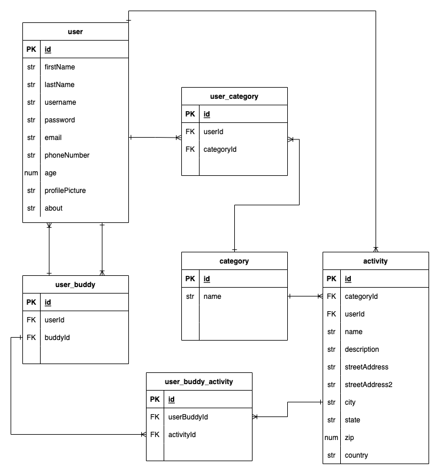

# Buddy Up Backend
## Date: 11/9/22

### By: Kalen Luciano, Shondriane Mesa-Wise, and Aekangi Patel

### Kalen Luciano: [Github](https://github.com/kalenluciano) | [Linkedin](https://www.linkedin.com/in/kalenluciano/)
### Aekangi Patel: [Github](https://github.com/Aekangi) | [Linkedin](https://www.linkedin.com/in/aekangipatel/)
### Shondriane Mesa-Wise: [Github](https://github.com/shondriane) | [LinkedIn](https://www.linkedin.com/in/shondriane-mesa-wise/)

***

### ***Description***
The goal of the website is to provide users with knowledge of existing rides and read/write reviews by other amusement park guests.
***

### ***Technologies Used***

* PostgreSQL + Sequelize
* Express.js
* React
* Node.js
* JavaScript

***

### ***Getting Started***
1.  Fork and clone
2.  npm install
3.  npm run dev

A trello board used to keep track of development progress can be [viewed here](https://trello.com/b/y27ScqGm/buddy-up).

The project itself was deployed and can be [viewed here]().

### ***Photos***

***

### ***Credits***

