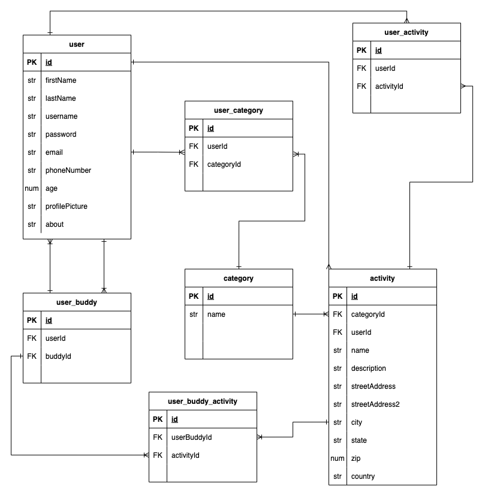

# BuddyUp Backend

## Date: 11/9/22

### By: Kalen Luciano, Shondriane Mesa-Wise, and Aekangi Patel

### Kalen Luciano: [Github](https://github.com/kalenluciano) | [Linkedin](https://www.linkedin.com/in/kalenluciano/)

### Shondriane Mesa-Wise: [Github](https://github.com/shondriane) | [LinkedIn](https://www.linkedin.com/in/shondriane-mesa-wise/)

### Aekangi Patel: [Github](https://github.com/Aekangi) | [Linkedin](https://www.linkedin.com/in/aekangipatel/)

---

### **_Description_**

BuddyUp was created so people can do activities and go to events with others who have similiar interest but don't want to go alone.

---

### **_Getting Started_**

1. `Fork` and `clone`
2. `cd` into the directory
3. Run `npm run setup`
4. Run `npm run dev`

A trello board used to keep track of development progress can be [viewed here](https://trello.com/b/y27ScqGm/buddy-up)

The project itself was deployed and can be [viewed here](https://buddy-match-up.herokuapp.com)

---

### **_Technologies Used_**

-   PostgreSQL + Sequelize
-   Express.js
-   React
-   Node.js
-   JavaScript

**_Entity Hierarchy Diagram:_**

---

### **_Future Features_**

--- send messages to buddies within the app
--  video chat within the app
